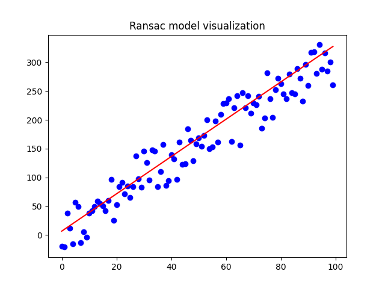

# RANSAC Assignment

## Contents
* RandomDatapointGenerator.hpp: Header file that contains the Random datapoint generator for a given line and distance to the line
* ransac.hpp: Header file that contains the RANSAC class
* main.cpp: Main function to test the RANSAC implementation

## Testing
In order to test the RANSAC implementation, you need to have a docker setup. Inside this directory run the following commands:

```
docker build . -t ransac
docker run --rm -v "$PWD"/img:/ntua_assignment/img ransac
```

The terminal output is the slope and the intercept of the RANSAC line and the number of inliers. Inside the img folder you can find the plot that shows the fitting.

